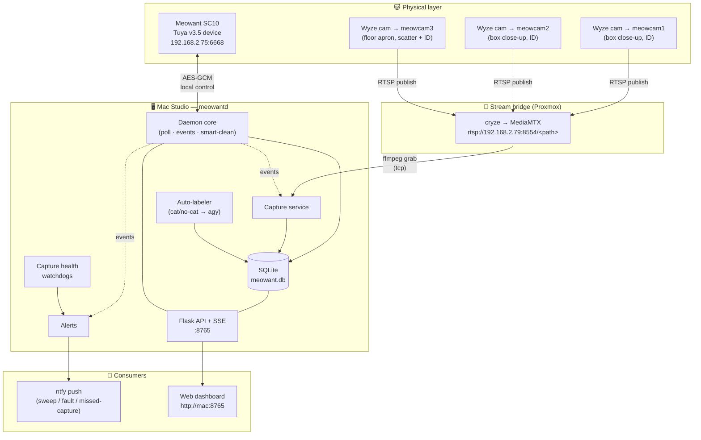
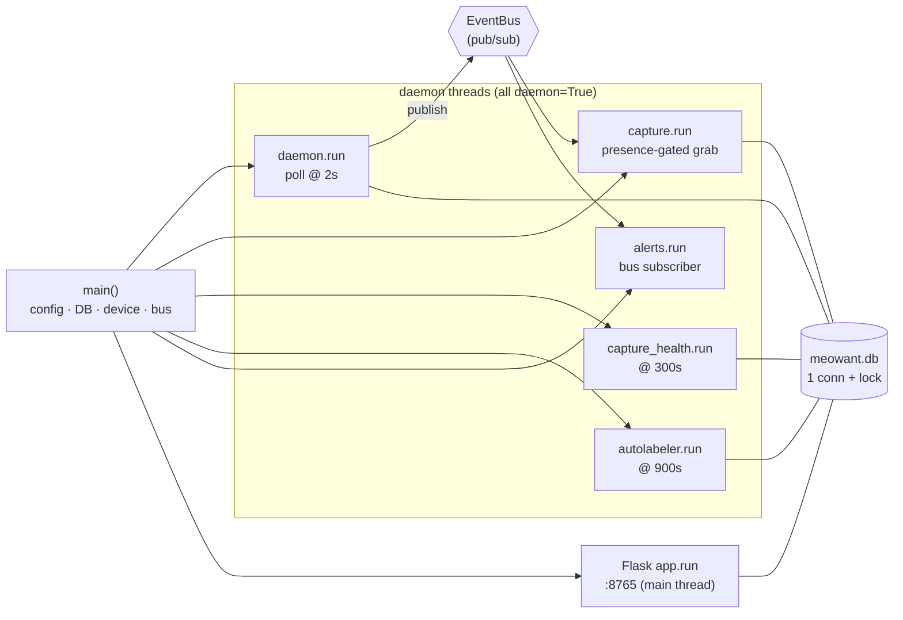
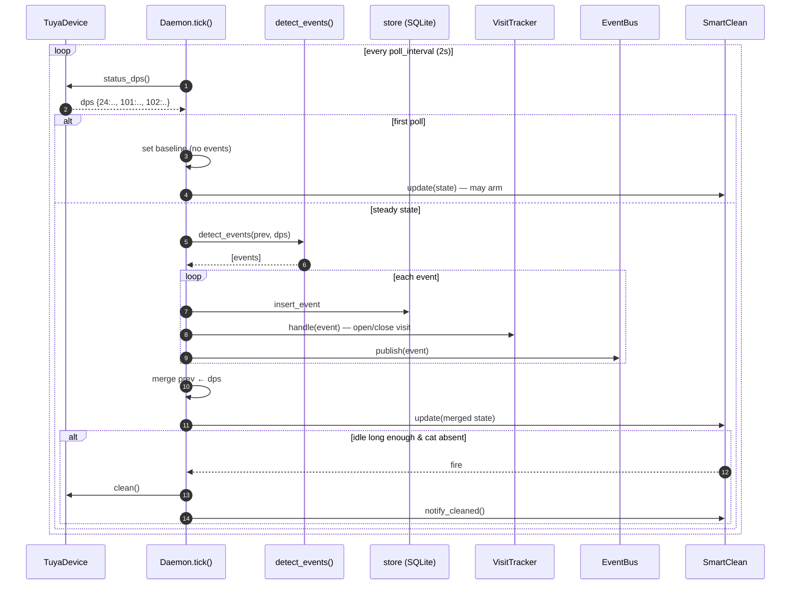
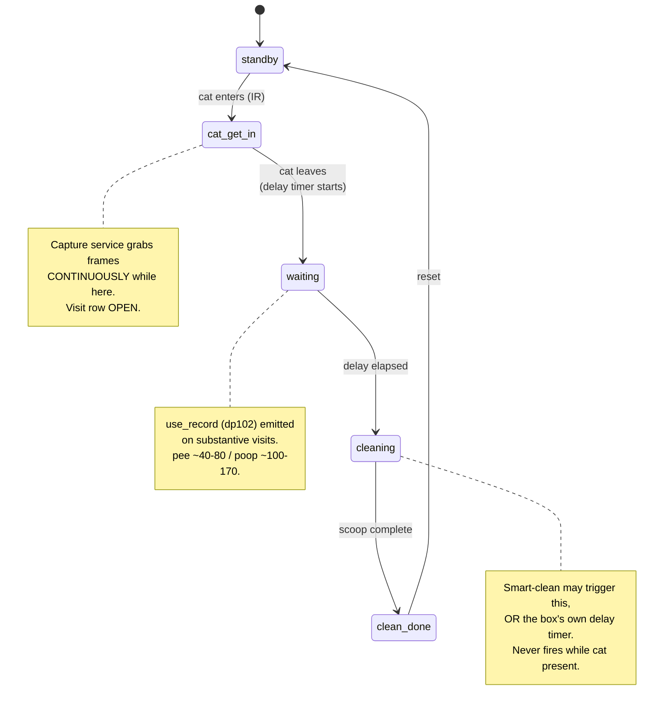
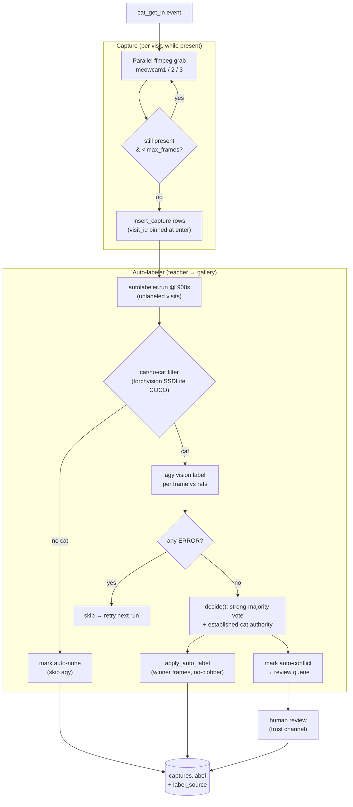
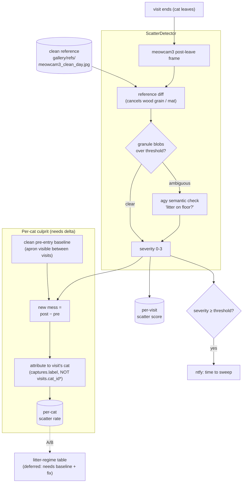
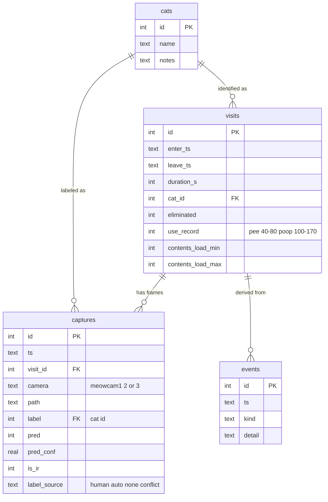
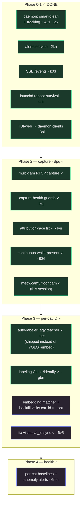
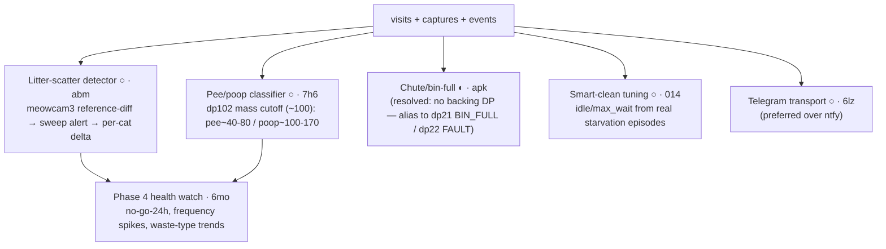
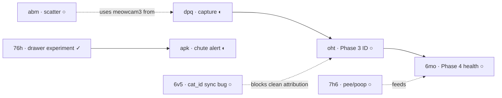

# Meowant SC10 — System Architecture

Local-first control, per-cat identification, and smart-care for a Meowant SC10
automatic litter box. No cloud dependency for the runtime path: the daemon owns
the device over Tuya's LAN protocol, turns data-point changes into semantic
visit events, photographs each visit over RTSP, and identifies which cat used
the box — all on the Mac.

> All diagrams below are [Mermaid](https://mermaid.js.org/) and render directly
> on GitHub and in VS Code.

---

## 1. System overview

How the physical world, the bridges, the daemon, and the consumers connect.

---

## 2. Process & threading model

`meowantd.py:main()` wires everything, then spawns five daemon threads and runs
Flask on the main thread. All threads share one SQLite connection
(`check_same_thread=False` + a module-level lock) and communicate through the
in-process `EventBus`.

---

## 3. Daemon poll loop & event flow

The heart of the system: `Daemon.tick()` runs every 2s. The first successful
poll only establishes a baseline (a restart must not synthesize fake edges);
thereafter, decoded DPS deltas become events that are persisted, fed to the
visit tracker, and published on the bus. Smart-clean runs on the *merged* state
(tolerating partial DPS updates).

---

## 4. Visit lifecycle — the dp24 state machine

`dp24` is the real, decoded state machine (richer than Tuya's spec'd
`standby|cleaning`). Visits, captures, and smart-clean all key off it. The box
detects presence only (IR) — there is **no scale**.

---

## 5. Capture + per-cat identification pipeline

When a cat enters, capture grabs frames from all cameras in parallel for the
duration of the visit. The auto-labeler then runs a two-stage
teacher→gallery loop: a cheap local cat/no-cat filter drops empty frames before
the expensive `agy` vision model names the cat, and a cross-frame agreement gate
only auto-applies confident calls — ambiguous visits defer to human review.

---

## 6. Scatter detection pipeline (planned — `meowant-abm`)

The digging-scatter problem: a cat flings litter onto the floor at the start of
a visit. No Tuya DPS carries a digging signal, so it must be *seen*. The new
`meowcam3` floor-apron angle makes cheap reference-differencing viable, with
`agy` as the semantic tiebreaker. Per-cat blame requires a **delta** against a
clean baseline (scatter persists across visits until swept).

\* `visits.cat_id` is not synced from the auto-labeler (bug `meowant-6v5`);
attribution reads `captures.label`, the source of truth.

---

## 7. Data model

---

## Key design decisions

| Decision | Why |
|---|---|
| **Daemon owns the single device socket** | Tuya v3.5 allows one local connection; everything else reads through the daemon's maintained `state`, no extra polling. |
| **Event-sourced visits** | DPS deltas → events → visit rows makes the history replayable and the smart-clean rule auditable. |
| **Presence-gated continuous capture** | Brief visitors (e.g. Ucok's in-and-out) are missed by a fixed burst; capture runs while `dp24==cat_get_in`. |
| **Cheap filter before expensive model** | torchvision cat/no-cat drops empty frames before `agy` is called — same teacher→student split reused for scatter. |
| **Trust channel (agreement gate)** | Only confident cross-frame majority auto-applies; ambiguous visits defer to human review, so the gallery stays clean. |
| **Scatter by reference-diff, not absolute** | Mess persists across visits; a clean-reference delta is the only honest way to attribute *new* mess to a cat. |

---

## 8. Roadmap & build status

Tracked in [beads](https://github.com/gastownhall/beads) (`bd list`). 21 issues:
12 done, 2 in progress, 7 open/blocked. The phases below reflect what is
**actually built**, which diverges from the original plan in two places (noted).

### Cross-cutting "smart-care" features

These sit on top of the core pipeline and feed Phase 4 health.

### Dependency chain

### Issue ledger

| Phase | ID | Status | What it is |
|---|---|---|---|
| 0-1 | `jqx` | ✓ | meowantd daemon: smart-clean + visit tracking + Flask API |
| 0-1 | `2kn` | ✓ | Alerts service (bin/chute/used-box/health) |
| 0-1 | `k03` | ✓ | SSE `/events` live stream |
| 0-1 | `cnf` | ✓ | launchd agent — survive reboots |
| 0-1 | `3pl` | ✓ | Refactor TUI + web to be daemon clients |
| 0-1 | `quq` | ✓ | Merge `meowantd-phase01` → main |
| 2 | `dpq` | ◐ | Multi-cam RTSP capture (cryze_v2 → MediaMTX); **3rd cam now wired** |
| 2 | `lzq` | ✓ | Capture-health: 0-frame guard + RTSP stream probe |
| 2 | `lyn` | ✓ | Fix capture→visit attribution race (pin `visit_id` at cat_enter) |
| 2 | `936` | ✓ | Capture cadence: continuous-while-present (catch brief visitors) |
| 3 | `uet` | ✓ | Auto-labeler: agy teacher + cross-frame gate + trust channel |
| 3 | `gbn` | ✓ | Labeling CLI + `/identify` + stub matcher + backfill plumbing |
| 3 | `oht` | ○ | Embedding matcher + live-attribute `visits.cat_id` (orig. YOLO plan) |
| 3 | `6v5` | ○ | **Bug:** `visits.cat_id` not synced from auto-labeler |
| 4 | `6mo` | ○ | Per-cat health/anomaly watch (baselines + alerts) |
| care | `abm` | ○ | Litter-scatter detector + sweep alert (meowcam3) |
| care | `7h6` | ○ | Confirm dp102 pee/poop cutoff + classify in events/alerts |
| care | `apk` | ◐ | Wire chute-full flag (resolve to dp21/dp22) |
| care | `014` | ○ | Tune smart-clean idle/max_wait from real data |
| care | `6lz` | ○ | Telegram notify transport |
| care | `76h` | ✓ | Drawer-pull experiment to identify chute-full flag |

> **Plan vs reality — two divergences worth knowing:**
> 1. **Phase 3 ID shipped as an agy-VLM auto-labeler (`uet`), not the planned
>    YOLO-crop → embedding → gallery-match (`oht`).** The VLM teacher reached 82%
>    on the hard brown-tabby pair and builds the gallery hands-free, so the
>    embedding matcher is now optional — its real remaining value is the
>    `visits.cat_id` backfill (coupled to bug `6v5`).
> 2. **`dpq` was blocked on "the third cam"; that's now resolved** (meowcam3 on
>    the .79 bridge), so capture is effectively complete — `dpq` can close once a
>    live visit confirms 3-cam capture.

